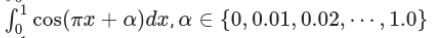

# Integral-Calculator-and-Plotter

## Overview

This Python program is designed to calculate integrals using the trapezoidal and Simpson's rule methods. It also provides the functionality to plot graphs of the integral values as they vary with the parameters.

## Features

- Calculate integrals in a given range using the trapezoidal rule.
- Calculate integrals in a given range using Simpson's rule.
- Perform calculations for a range of parameter values.
- Plot graphs of the integral values versus the parameters.

## Requirements

- Python 3.x
- NumPy
- Matplotlib

## Usage
Run the program with the following command:
```
python src.py
```

The program is tested and created specifically for this integral: 


